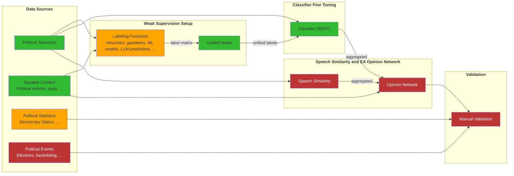

## Project flow
1. preprocess_tag.py
    - preprocesses the data: extracts speeches, makes stuff sentence level
    - applies the WS tagging algorithm
    - optionally runs evaluation
2. evaluate_tags.py (optional)
    - evaluates previously tagged data
3. train.py
    - trains an XLM-RoBERTa model on the WS labels from before
4. tag_new_data.py
    - tags new data using the newly trained classifier

## Project Structure

## Data
- I'll be using the 2017 Hungarian parliamentary speeches from ParlaMint for purposes of building the training data as it is supposed to contain some EA
- I'll be using the 2020 Hungarian parliamentary speeches from ParlaMint for purposes of validating the model, as it is during the COVID, which supposedly introduced more EA after the wake of emergency powers

## Docs

### Design Decisions

- three categories: CONTRA, NEUTRAL, PRO

#### WS
- sentence-level detection
- heavily lexicon-based (and language dependent, as such)

#### Experiment 1
- initial four pro-contra and five neutral, keyword and sentence length based classifiers
- from limited review, they seem to be working fine
- found only 60 positive things from 2014
- pretty abysmal results on the validation set

#### Experiment 2
- run it on 2014, 2015, 2016
- seems to be extremely slow at the WS level, so I'll have to do something about it
- got more data, ~200 sentences that were pro and contra alltogether
- decent results on the second and third class (f1 0.9 and 0.67), but 0 predictions of the 1st class type
- output is all green and neutral
- conclusions: I need better labeling functions and a better way to handle data if I want to ever get anywhere
- lessons: data extraction is incredibly slow and labeling quality leaves a lot to be desired

## Structure

### Annotators
- the current version of the annotator functions can be found in the `annotators` module
- older versions are in the `annotators-v<nr>` folders for easy and quick reproducibility (dynamic module loading and all that jazz)